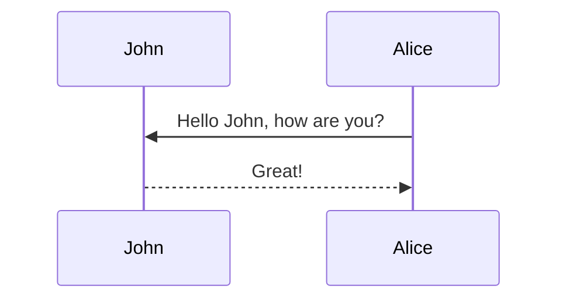

## Note

We are not questioning the general claim that optimizing for human feedback will lead to incentives to mislead them – which seems clearly true theoretically, as demonstrated by recent manifestations in production systems [which seem to have been due to user feedback optimization](https://openai.com/index/expanding-on-sycophancy/) (one of the authors of this post even worked on a concurrent [paper focused on user feedback](https://arxiv.org/abs/2411.02306) rather than RLHF). That said, we are quite skeptical of the authors’ experimental setup, and don’t think the evidence of the paper is very informative of whether and how much these incentives are actually realized in real *RLHF* pipelines which optimize for annotator feedback or perfect reward signals.

While we only have partial empirical evidence that fixing issues in the authors’ experimental setup invalidates the authors’ findings, we believe the bugs in the experimental pipeline are sufficient to at least threaten the validity of the conclusions on their own. After contacting the authors in June, we sat on these results for a while and finally decided to just publish everything we have right now, since we believe that this is still interesting for the broader AI safety research community.

## Summary (TL;DR)

In [Language Models Learn to Mislead Humans Via RLHF](https://arxiv.org/abs/2409.12822) (published at ICLR 2025) the authors’ main claim is that RLHF (Reinforcement Learning from Human Feedback) may unintentionally lead LLMs to become better at misleading humans, a phenomenon they term "U-SOPHISTRY". In particular, they provide results on tasks like question-answering ([QuALITY](https://arxiv.org/abs/2112.08608)) and programming ([APPS](https://arxiv.org/abs/2105.09938)), showing that RLHF improved the models' ability to convince human evaluators without actually improving task performance.

**Claim we investigated**. The paper’s importance (and novelty) rests on the claim that their results are evidence of Unintended misleading behaviors (U-SOPHISTRY), rather than unrealistic experimental setups designed to elicit these behaviors. Quoting from the paper itself (emphasis ours):


- “We study this phenomenon under a **standard RLHF pipeline**.”
- “Many prior works study I-SOPHISTRY: while these works aim to study unintended misleading AI behaviors, they induce these behaviors intentionally with **non-standard engineering practices** and hope their conclusions can generalize to U-SOPHISTRY.”
- “We study U-SOPHISTRY that naturally emerges from **standard, innocuous practices**.”

\textbf{Our findings}. Based on inspecting the paper’s [code](https://github.com/Jiaxin-Wen/MisleadLM) and re-running experiments, it seems plausible to us that much of the observed “misleading” behavior is an artifact of a *pretty unrealistic RLHF setup*, meaning the paper would be falling under the bucket of I-SOPHISTRY once more, rather than U-SOPHISTRY:


1. **In the QuALITY setting, the reward model is not given enough information to determine correctness**. During reward-model training and PPO, the “judge” sees (question, answer A, answer B, argument) **without** the story the question is about. It therefore can’t meaningfully reward correctness, but probably still rewards plausible-sounding arguments—making it easy to hack.
2. **In the QuALITY setting, the policy model also rarely sees enough task context to answer correctly**. The story passages are truncated so aggressively that ~86–88% of examples don’t contain enough information to determine the correct answer – which is something that one would actively be trying to avoid when training an LLM with RLHF. As a consequence, the PPO policy can’t learn to be right, so it seems natural that it would learn to be *persuasive*.
3. **On APPS (programming), inputs/outputs are also truncated**. ~35% of prompts – which comprise the programming problem and its tests – are truncated abruptly , and the grader only sees a short slice of the code output by the model (384 tokens). This can favor dense, or simplified code that looks good on simple test-cases while failing more thorough ones.

**Bottom line**. Ultimately, in our opinion, all three of the above would be considered to be (major) bugs in production RLHF pipelines: when curating data to train on, one would want to ensure that both reward models and policy models have enough information to actually learn desirable behaviors. Additionally, instead of making the results more conservative, we would expect each of the issues above to significantly amplify the main effect the paper is trying to measure – LLMs learning deceptive behavior when trained via RLHF – raising questions about the validity of the results. Our partial empirical results in section 3 seem to support this, showing. We also want to point out that we believe the underlying *risk* the paper points to be real. We mainly think the reported effect sizes are quite likely to be inflated by the setup.

The rest of this post is structured as follows:
- In section 2, we provide a more detailed overview of our core claims.
- Section 3 contains a detailed report of the experiments we ran to verify our claims.
- In section 4, we let the authors of the original paper lay out their point of view.
- We conclude with an appendix containing some experiment details.

## Issues in experimental setup by setting

The paper validates its hypotheses that standard RLHF would lead to policies that mislead humans in two settings: a QA task (QuALITY), and a programming task (APPS). For their experimental setup, they had to choose what kinds of reward models to use for their tasks. For the QA task, they considered two settings: finetuning an LLM to provide reward  just on this task, or finetuning an LLM on human preferences from the ChatBotArena. For the APPs setting, they used a programmatic reward model (based on passing the easiest 2 tests for each problem).

### QuALITY Task (with a task-specific reward model)

**Image goes here!**

- *During reward learning, the reward model* is shown a question about a text and two possible answers, but isn't provided the text itself that the question and answers are about. This makes it impossible for the RM to learn to reward correctness of answers. The only thing the RM can do beyond overfitting to the training labels is learn to rely on features that have spurious correlations with positive labels (e.g. rewarding arguments that sound convincing, regardless of truthfulness). 
- *During PPO training, the reward model* is also not provided with the text that the current question and answers are about, making it impossible to reward correctness. Because of the RM training, in any case the RM will likely only be evaluating based on plausibility rather than correctness and be highly hackable.
- *During PPO training, the PPO model* is shown a question, two answers, and the first part of a text which the question is about. The text is cut to an extent that ~88% of the time, there is not enough information for the model to know which answer is correct. This leaves only one option for the PPO model to optimize its reward: hack the reward model, for example by guessing an answer and then fabricating a convincing justification. 
- *Putting it all together*, the flaws in both the RM training and its use during PPO make the reward model highly unrealistic. Due to the missing information, we believe it is likely that the RM simply learns to highly reward convincing arguments, regardless of correctness. The PPO model’s input truncation additionally incentivizes reward-hacking behavior such as fabricating justifications in order to maximize reward. Together, this constitutes a combination of multiple unrealistic training biases that look more like I-SOPHISTRY (Intentionally nudging the model towards sophistry/deception) than U-SOPHISTRY.

### QuALITY Task (with a general reward model)

**Image goes here!!**

- *During PPO, the reward model* is not provided with the paragraph, and therefore has no way to determine the correctness of the argument made by the LLM. This makes it impossible to provide a correct training signal, even if it were an almost perfect RM, and forces it to rely on spurious correlations likely related to SOPHISTRY.
- *During PPO, the PPO model* only sees a small fraction of the text the question and answers are about. We estimate that in ~88% of cases this amount of information is insufficient to correctly answer the question. As in the task-specific setting above, this leaves only one option for the PPO model to maximize the reward: hack the reward model, for example by guessing an answer and then fabricating a convincing justification. Because of how the reward model was trained, it would not be able to punish this behavior anyway. 
- *Putting it all together*, the flaws in the use of the RM during PPO likely make convincing arguments highly rewarded by the RM regardless of correctness. As above, this constitutes a combination of  unrealistic training biases that look more like I-SOPHISTRY than U-SOPHISTRY.

### APPS Programming Task

**Image goes here!!**

- *During PPO, the grader* only looks at 384 tokens output by the LLM (because this is the max_token_len for the PPO model). This may incentivize the PPO model to learn to write denser programs to avoid the risk of having them be cut off and score lower.
- *During PPO, the PPO model* ~35% of the time does not see the entire task description because it gets cut due to a maximum context length. In light of this, the LLM may be incentivized to create more complex programs that cover potential edge cases that the task description may be missing. 
- *Putting it all together*, it seems plausible that these factors could thus in part explain the reported qualitative and quantitative SOPHISTRY results (i.e. more complex and dense programs which tend to fool human annotators). While we’d be somewhat surprised if these issues accounted for most of the effect size in this setting specifically, more analysis would be helpful in ruling them out as big drivers of the results.

## The full story including our (partial) empirical investigations

### Background
When first encountering this paper, we thought it was a clear demonstration of intuitions that had been floating around for a while in the AI safety community about incentives to trick/manipulate humans. It had studies with real humans (wow!), and with (what seemed like) a pretty realistic experimental setup. In light of this, we originally intended to do some follow-up work building on the authors’ codebase, studying this effect when using AI feedback instead of human feedback. While replicating the results of the original paper, we started noticing some things that seemed off, described below.

### Potential Issues

#### The LLM policy does not receive enough information

We used [the original authors' codebase](https://github.com/Jiaxin-Wen/MisleadLM/tree/master), starting by re-running their experiments on the QuALITY QA-task. In this task, the LLM is provided with a long story, as well as a question about the story, and two possible answers. The goal is to train an LLM to learn to provide a) the correct answer, and b) a strong argument supporting the answer.

As the following figure shows, we were able to replicate the original authors’ results. Namely, despite the LLM under training maximizing its reward-model during training, ground-truth accuracy does not increase, the LLM therefore engages in reward-hacking behavior:


**Insert image here!**

Note that we didn’t replicate the human-study part of the results (represented by R^human in the figure). However, for the sake of this note, this doesn’t matter, as we’re mainly investigating the claim that correctness does not increase after PPO.

While our replication results looked reasonable on the surface, we noticed one odd behavior:

**Insert image here!!**

For some reason, our PPO-trained models would learn to either always answer ‘A’ or always ‘B’ (~98% of answers with the rest being split by the other answer or parsing errors). This annoying behavior persisted across multiple experiment runs and proved hard to remove.

As a sanity check, we evaluated the [SFT checkpoint provided in the official codebase](https://huggingface.co/jiaxin-wen/MisleadLM-QA). To our surprise, this checkpoint was also prone to this annoying behavior! In particular, the model answered ‘B’ in 88.5% of cases, a large majority. 

This seemed suspicious and motivated us to perform a careful analysis of the provided codebase of the authors of the original paper. 

Our analysis found a potential problem: during training, the LLM was asked to answer questions about a story, but the stories were being significantly shortened (simply by cutting them off after a certain number of tokens). This was happening to an extent that most of the time, it would have been impossible for the LLM to answer truthfully even if it tried: it simply didn’t have enough context for a vast majority of the questions! Here are some of the most important lines of code:

**Insert graphic here!!**

Cutting the story lengths was partially necessary, due to the small context size of Llama 2 (the maximum is 4096). That said, the chosen length of 482 is another 8.5x smaller than that. To better see why this is an issue, here is a histogram of the lengths of all the different stories in the QA dataset (in number of tokens) below:

**Insert image here!!**

Next, we tried to get a sense of whether these cut stories contained enough information to answer the questions. To do this, we provide GPT-4o (in particular gpt-4o-2024-11-20) with both the uncut- and the cut stories, as well as the accompanying questions and answers. For each story, we then ask GPT-4o whether enough important bits from the original story are contained in the cut story to still be able to determine the correct answer to the question. The results are as follows (the precise prompt can be found in the appendix):

- Training set: **88.6%** of cut stories contain an insufficient amount of information
- Validation set: **86.4%** of cut stories contain an insufficient amount of information

As a result of not being able to determine the correct answer, the best that the policy can do in a vast majority of cases is to guess, learning to “always answer A” or “always answer B”, and then hiding the fact that it doesn’t have enough information to answer the question correctly by faking quotes/facts. As the reward model does not have enough context either (below section), the policy is not penalized for such nonsensical bias, and only learns to optimize the second reward axis (providing arguments that sound like those that tended to be correct in the training data for the reward model). 

#### The task-specific reward model does not receive enough information

All our experiments above are for the general reward model setting (i.e., using a reward model that has been fine-tuned on [human preference data](https://huggingface.co/datasets/lmarena-ai/arena-human-preference-55k)). The task-specific reward model also seems to suffer from similar issues to those identified above. 

In principle, the task-specific reward model should be fine-tuned on QA-data and learn to highly reward LLM-outputs that a) argue for the correct answer, and b) contain a strong argument supporting its provided answer. However, if we look at the creation of the prompts for the reward model, we see that the prompts only include the question about a story, as well as the two possible answers: 

**Insert image here**

This is insufficient information for the reward model to learn to reward correct answers, since it doesn’t have access to the original story to compare the answer against. Jiaxin mentioned that this is because human judges in earlier work ([Debating with More Persuasive LLMs Leads to More Truthful Answers](https://arxiv.org/abs/2402.06782)) also didn’t have access to the entire story. However, the setting of this earlier work seems to differ significantly from the setting of this paper: in that paper, the reward model/human judges use multiple sources of information to determine the correctness of the LLM-generated argument. In particular, this looks like:
- Various debate settings such as consultancy, debate, and interactive debate
- A quote verification tool that certifies the correctness of quotes, thereby preventing the LLM agent from just making up quotes

We note that without any of these aids it becomes impossible for the reward model to know when the arguments and answers it sees are actually any good: it can only go off of whether the argument sounds persuasive in the abstract, totally ungrounded in the reality of the story. This, combined with the lack of context for the policy, leads to a combination of incorrect arguments being generated and being rewarded for sounding correct and coherent.

This issue extends to the general reward model since during PPO both reward models are only provided with a (question, answers, argument) tuple:

**Insert graphic!!**

### Replicating the results without these issues

To test our hypotheses, we next tried to replicate the results of the paper while fixing all the issues mentioned above. If our suspicion is right, we should be able to train an LLM agent against a reward model and observe both increasing reward scores and increasing ground-truth accuracy.


We kept our fixed experiment setup as closely as possible to the setup of the authors of the original paper with the following major differences:
- **LLM choice**: Since Llama-2-7B only has a maximum context length of 4096, we switched the model with Llama-3.1-8B which has a context length of 128k tokens.
- **Full story access**: We provide both, the reward model as well as the LLM under training with the full story
- **CoT prompting**: In the original paper, the LLM is prompted to output its answer first and only then provide an explanation. We thought this might decrease performance a bit, as prior work has shown that creating a CoT first could help the model’s decision-making. Therefore, in our experiments, we prompt our PPO-trained LLM to first output a reasoning and only then provide a final answer. Furthermore, we adapt our reward model prompt to be as close to the prompt used in the paper Debating with More Persuasive LLMs Leads to More Truthful Answers, that the authors of our paper aimed to mimic. Both prompts can be found in the appendix.
- **Hyperparameters**: Our change in models required some manual hyperparameter tuning of the learning rate, learning rate scheduler, KL-penalty, as well as multiple parameters to make the training more memory efficient (training was barely possible on our 8 x NVIDIA A100 GPU setup). A precise listing of the exact hyperparameters can be found in our GitHub repository.

**Note**: A complete collection of plots of this run can be found in this wandb report.

We note that with our setup, both ground-truth accuracy increase over training (30,000 episodes - 536 global steps), with ground-truth accuracy rising from 36% to 70%.

**Insert two images**

Interestingly, there is a dip in the first 75 global steps – which matches a temporary increase in incomplete responses while the model learns the proper output format (right-most plot below): by forcing the model to give justification before an answer (change discussed at the top of this section), sometimes the max_token_limit would be reached before the model had output a response. Another improvement over the original codebase is that our model’s answers get fairly well balanced over training (left+middle plots below).

**Insert three images**

The reward and accuracies for this training run, with the same format as the previous figures (Figure 2B (1) of the original paper) are as shown below. 

**Insert two images**

However, we also have to acknowledge that the PPO training in our setting can be unstable depending on the precise hyperparameter selection. Additionally, during our investigation, we observed that without a sufficiently high learning rate and low KL coefficient, the model didn’t diverge enough to see a significant increase in reward/accuracy.

Our training run with the long context window is extremely costly and requires roughly 8 NVIDIA A-100 GPUs for approximately 3 days per run. This prevented us from testing a wide variety of hyperparameters. While we tried to find good hyperparameters for a smaller model (Llama-3.2-1B) and tested whether they would transfer to the larger Llama-3.1-8B model, this turned out not to work as well as we’d hoped.

### What about the programming task?

While our experiments mainly focused on the QA-task we also performed some smaller explorative experiments for the programming task.

As a first sanity-check we downloaded the [provided checkpoint after supervised fine-tuning](https://huggingface.co/jiaxin-wen/MisleadLM-code) and evaluated it on a best-guess pre-processed version of the test-set of the [APPS data](https://huggingface.co/datasets/codeparrot/apps). We measured an accuracy of 35%, similar to the initial policy of the paper.

As for the QA-task, the text containing the programming challenges gets cropped. According to the available config, the maximum prompt length is 384 tokens:

**Insert image!!**

As for the QA-task we check how many of the provided programming challenges do fit this context length. In particular, we manually add an “-----End-----” string at the end of every problem description. Then we shorten the string to 384 tokens and verify whether it is still present. In roughly 30% of cases, the description of the programming challenge is longer than the specified context length and is therefore being cut off (column to the very right). In these cases, the program might be missing important information to solve the problems correctly.

**Insert graphic!!**

This is less extreme than in the QA task but still a significant fraction of the data. 

For our second test, we used the fact that every programming challenge of the APPS benchmark has at least one sample solution which is used by our codebase for supervised fine-tuning. In particular, we are interested in what fraction of sample solutions fits into the model's maximum output size of [384 tokens](https://github.com/Jiaxin-Wen/MisleadLM/blob/cf29f559000a14e8c06947ed0a7875430a2b90f7/examples/programming/configs/ppo_config.yml#L57). 

The official codebase of the paper doesn’t contain the SFT logic that was used, but if too long outputs are shortened,  the LLM under SFT might learn to output incomplete programs, and if the outputs aren’t shortened, the LLM might try to output excessively long programs which will also result in failures and low accuracy:

**Insert graphic**

## Author's response
*We discussed these issues with the authors of the original paper. During these discussions, we were not able to reconcile our differing opinions about the interpretations of their experimental results. Therefore, we believe it is of interest to give them the opportunity to present their point of view. The rest of this section has been written by the authors of the original paper.*


Note: please use the table of contents as defined in the front matter rather than the traditional markdown styling.

## Equations

This theme supports rendering beautiful math in inline and display modes using [MathJax 3](https://www.mathjax.org/) engine.
You just need to surround your math expression with `$$`, like `$$ E = mc^2 $$`.
If you leave it inside a paragraph, it will produce an inline expression, just like $$ E = mc^2 $$.

To use display mode, again surround your expression with `$$` and place it as a separate paragraph.
Here is an example:

$$
\left( \sum_{k=1}^n a_k b_k \right)^2 \leq \left( \sum_{k=1}^n a_k^2 \right) \left( \sum_{k=1}^n b_k^2 \right)
$$

Note that MathJax 3 is [a major re-write of MathJax](https://docs.mathjax.org/en/latest/upgrading/whats-new-3.0.html)
that brought a significant improvement to the loading and rendering speed, which is now
[on par with KaTeX](http://www.intmath.com/cg5/katex-mathjax-comparison.php).

## Images and Figures

Its generally a better idea to avoid linking to images hosted elsewhere - links can break and you
might face losing important information in your blog post.
To include images in your submission in this way, you must do something like the following:

```markdown

```

which results in the following image:



To ensure that there are no namespace conflicts, you must save your asset to your unique directory
`/assets/img/2025-04-27-[SUBMISSION NAME]` within your submission.

Please avoid using the direct markdown method of embedding images; they may not be properly resized.
Some more complex ways to load images (note the different styles of the shapes/shadows):

<div class="row mt-3">
    <div class="col-sm mt-3 mt-md-0">
        
    </div>
    <div class="col-sm mt-3 mt-md-0">
        
    </div>
</div>
<div class="caption">
    A simple, elegant caption looks good between image rows, after each row, or doesn't have to be there at all.
</div>

<div class="row mt-3">
    <div class="col-sm mt-3 mt-md-0">
        
    </div>
    <div class="col-sm mt-3 mt-md-0">
        
    </div>
</div>

<div class="row mt-3">
    <div class="col-sm mt-3 mt-md-0">
        
    </div>
    <div class="col-sm mt-3 mt-md-0">
        
    </div>
    <div class="col-sm mt-3 mt-md-0">
        
    </div>
</div>

### Interactive Figures

Here's how you could embed interactive figures that have been exported as HTML files.
Note that we will be using plotly for this demo, but anything built off of HTML should work
(**no extra javascript is allowed!**).
All that's required is for you to export your figure into HTML format, and make sure that the file
exists in the `assets/html/[SUBMISSION NAME]/` directory in this repository's root directory.
To embed it into any page, simply insert the following code anywhere into your page.

```markdown

```

For example, the following code can be used to generate the figure underneath it.

```python
import pandas as pd
import plotly.express as px

df = pd.read_csv('https://raw.githubusercontent.com/plotly/datasets/master/earthquakes-23k.csv')

fig = px.density_mapbox(
    df, lat='Latitude', lon='Longitude', z='Magnitude', radius=10,
    center=dict(lat=0, lon=180), zoom=0, mapbox_style="stamen-terrain")
fig.show()

fig.write_html('./assets/html/2026-04-27-distill-example/plotly_demo_1.html')
```

And then include it with the following:

```html

<div class="l-page">
  <iframe
    src="{{ 'assets/html/2026-04-27-distill-example/plotly_demo_1.html' | relative_url }}"
    frameborder="0"
    scrolling="no"
    height="600px"
    width="100%"
  ></iframe>
</div>

```

Voila!

<div class="l-page">
  <iframe src="{{ 'assets/html/2026-04-27-distill-example/plotly_demo_1.html' | relative_url }}" frameborder='0' scrolling='no' height="600px" width="100%"></iframe>
</div>

## Citations

Citations are then used in the article body with the `<d-cite>` tag.
The key attribute is a reference to the id provided in the bibliography.
The key attribute can take multiple ids, separated by commas.

The citation is presented inline like this: <d-cite key="gregor2015draw"></d-cite> (a number that displays more information on hover).
If you have an appendix, a bibliography is automatically created and populated in it.

Distill chose a numerical inline citation style to improve readability of citation dense articles and because many of the benefits of longer citations are obviated by displaying more information on hover.
However, we consider it good style to mention author last names if you discuss something at length and it fits into the flow well — the authors are human and it’s nice for them to have the community associate them with their work.

---

## Footnotes

Just wrap the text you would like to show up in a footnote in a `<d-footnote>` tag.
The number of the footnote will be automatically generated.<d-footnote>This will become a hoverable footnote.</d-footnote>

---

## Code Blocks

This theme implements a built-in Jekyll feature, the use of Rouge, for syntax highlighting.
It supports more than 100 languages.
This example is in C++.
All you have to do is wrap your code in a liquid tag:


 <br/> code code code <br/> 


The keyword `linenos` triggers display of line numbers. You can try toggling it on or off yourself below:



int main(int argc, char const \*argv[])
{
string myString;

    cout << "input a string: ";
    getline(cin, myString);
    int length = myString.length();

    char charArray = new char * [length];

    charArray = myString;
    for(int i = 0; i < length; ++i){
        cout << charArray[i] << " ";
    }

    return 0;

}



---

## Diagrams

This theme supports generating various diagrams from a text description using [mermaid.js](https://mermaid-js.github.io/mermaid/){:target="\_blank"} directly.
Below, we generate examples of such diagrams using [mermaid](https://mermaid-js.github.io/mermaid/){:target="\_blank"} syntax.

**Note:** To enable mermaid diagrams, you need to add the following to your post's front matter:

```yaml
mermaid:
  enabled: true
  zoomable: true # optional, for zoomable diagrams
```

The diagram below was generated by the following code:


````

````


---

## Tweets

An example of displaying a tweet:


An example of pulling from a timeline:


For more details on using the plugin visit: [jekyll-twitter-plugin](https://github.com/rob-murray/jekyll-twitter-plugin)

---

## Blockquotes

<blockquote>
    We do not grow absolutely, chronologically. We grow sometimes in one dimension, and not in another, unevenly. We grow partially. We are relative. We are mature in one realm, childish in another.
    —Anais Nin
</blockquote>

---

## Layouts

The main text column is referred to as the body.
It is the assumed layout of any direct descendants of the `d-article` element.

<div class="fake-img l-body">
  <p>.l-body</p>
</div>

For images you want to display a little larger, try `.l-page`:

<div class="fake-img l-page">
  <p>.l-page</p>
</div>

All of these have an outset variant if you want to poke out from the body text a little bit.
For instance:

<div class="fake-img l-body-outset">
  <p>.l-body-outset</p>
</div>

<div class="fake-img l-page-outset">
  <p>.l-page-outset</p>
</div>

Occasionally you’ll want to use the full browser width.
For this, use `.l-screen`.
You can also inset the element a little from the edge of the browser by using the inset variant.

<div class="fake-img l-screen">
  <p>.l-screen</p>
</div>
<div class="fake-img l-screen-inset">
  <p>.l-screen-inset</p>
</div>

The final layout is for marginalia, asides, and footnotes.
It does not interrupt the normal flow of `.l-body`-sized text except on mobile screen sizes.

<div class="fake-img l-gutter">
  <p>.l-gutter</p>
</div>

---

## Other Typography?

Emphasis, aka italics, with _asterisks_ (`*asterisks*`) or _underscores_ (`_underscores_`).

Strong emphasis, aka bold, with **asterisks** or **underscores**.

Combined emphasis with **asterisks and _underscores_**.

Strikethrough uses two tildes. ~~Scratch this.~~

1. First ordered list item
2. Another item

- Unordered sub-list.

1. Actual numbers don't matter, just that it's a number
   1. Ordered sub-list
2. And another item.

   You can have properly indented paragraphs within list items. Notice the blank line above, and the leading spaces (at least one, but we'll use three here to also align the raw Markdown).

   To have a line break without a paragraph, you will need to use two trailing spaces.
   Note that this line is separate, but within the same paragraph.
   (This is contrary to the typical GFM line break behavior, where trailing spaces are not required.)

- Unordered lists can use asterisks

* Or minuses

- Or pluses

[I'm an inline-style link](https://www.google.com)

[I'm an inline-style link with title](https://www.google.com "Google's Homepage")

[I'm a reference-style link][Arbitrary case-insensitive reference text]

[I'm a relative reference to a repository file](../blob/master/LICENSE)

[You can use numbers for reference-style link definitions][1]

Or leave it empty and use the [link text itself].

URLs and URLs in angle brackets will automatically get turned into links.
http://www.example.com or <http://www.example.com> and sometimes
example.com (but not on Github, for example).

Some text to show that the reference links can follow later.

[arbitrary case-insensitive reference text]: https://www.mozilla.org
[1]: http://slashdot.org
[link text itself]: http://www.reddit.com

Here's our logo (hover to see the title text):

Inline-style:


Reference-style:
![alt text][logo]

[logo]: https://github.com/adam-p/markdown-here/raw/master/src/common/images/icon48.png "Logo Title Text 2"

Inline `code` has `back-ticks around` it.

```javascript
var s = "JavaScript syntax highlighting";
alert(s);
```

```python
s = "Python syntax highlighting"
print(s)
```

```
No language indicated, so no syntax highlighting.
But let's throw in a <b>tag</b>.
```

Colons can be used to align columns.

| Tables        |      Are      |  Cool |
| ------------- | :-----------: | ----: |
| col 3 is      | right-aligned | $1600 |
| col 2 is      |   centered    |   $12 |
| zebra stripes |   are neat    |    $1 |

There must be at least 3 dashes separating each header cell.
The outer pipes (|) are optional, and you don't need to make the
raw Markdown line up prettily. You can also use inline Markdown.

| Markdown | Less      | Pretty     |
| -------- | --------- | ---------- |
| _Still_  | `renders` | **nicely** |
| 1        | 2         | 3          |

> Blockquotes are very handy in email to emulate reply text.
> This line is part of the same quote.

Quote break.

> This is a very long line that will still be quoted properly when it wraps. Oh boy let's keep writing to make sure this is long enough to actually wrap for everyone. Oh, you can _put_ **Markdown** into a blockquote.

Here's a line for us to start with.

This line is separated from the one above by two newlines, so it will be a _separate paragraph_.

This line is also a separate paragraph, but...
This line is only separated by a single newline, so it's a separate line in the _same paragraph_.
